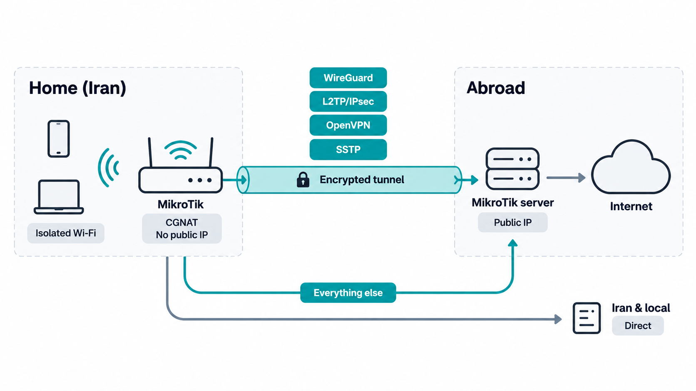
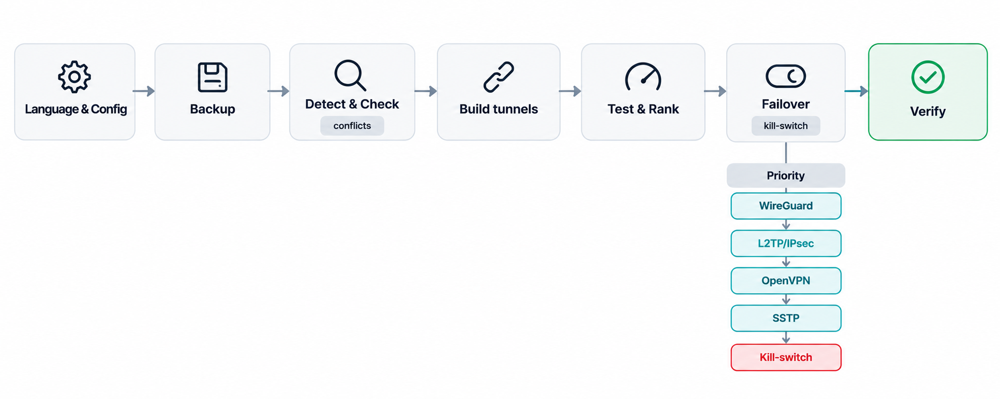

[English 🇬🇧](README.md)

# تانل عبور از محدودیت: میکروتیک خانگی ← سرور خارج

روی یک میکروتیک خانگی در شبکهٔ محدودشده (پشت CGNAT و بدون IP عمومی) چند تانل پایدار و کنار هم
به یک سرور میکروتیک در خارج می‌سازد و ترافیک کلاینت‌های انتخاب‌شده را از راه همان سرور به
اینترنت می‌رساند؛ در همین حال ترافیک لوکال و ایرانی مستقیم می‌ماند.

**این یکی از آن اسنیپت‌های تست‌نشدهٔ اینترنت نیست؛ روی سخت‌افزار واقعی و RouterOS v7 کامل ساخته و
تست شده.**

  

> **📌 مهم**
>
> این پرامپت یک ابزار کمکی برای کسانی است که **میکروتیک و پایهٔ شبکه را بلدند** و کاری را که
> خودشان از پسش برمی‌آیند سریع‌تر و کم‌ریسک‌تر می‌کند. این یک ابزار «صفر تا صد» نیست، شبکه را به
> شما یاد نمی‌دهد و فرض را بر این می‌گذارد که می‌توانید config روتر را بخوانید و قبل از تأیید،
> نقشهٔ کار ایجنت را بسنجید.

## چه کار می‌کند؟

- **چهار نوع تانل** را کنار هم بالا می‌آورد (WireGuard، L2TP/IPsec، OpenVPN و SSTP) که همه از
  سمت روتر خانگی به بیرون وصل می‌شوند، پس حتی پشت CGNAT هم کار می‌کند.
- همیشه **بهترین تانلِ در دسترس** را فعال نگه می‌دارد و اگر قطع شد، خودکار روی تانل بعدی
  failover می‌کند.
- ترافیک کلاینت‌های انتخاب‌شده را از راه سرور بیرون می‌فرستد، اما **مقصدهای ایرانی و لوکال
  مستقیم می‌مانند** (تا بانک اینترنتی و سرویس‌های داخلی درست کار کنند).
- سرویس DNSِ خارجی را داخل تانل نگه می‌دارد تا هم DNS leak رخ ندهد و هم به DNSِ خرابِ اپراتور
  وابسته نباشید.
- اگر بخواهید یک **Wi-Fi مجزا و ایزوله** می‌سازد تا فقط دستگاه‌هایی که به آن وصل می‌شوند از تانل
  رد شوند و شبکهٔ فعلی شما دست‌نخورده بماند.
- بدون تخریب کار می‌کند: config فعلی را می‌خواند، از تداخل پرهیز می‌کند، اول backup می‌گیرد و
  قابل برگشت است.

## چطور کار می‌کند؟

  

۱. **گرفتن اطلاعات:** ایجنت زبان شما را می‌پرسد و بخش `CONFIG` را می‌خواند.

۲. **بررسی اولیه:** نسخهٔ RouterOS را تشخیص می‌دهد، config فعلی را لیست می‌کند، تداخل‌ها را چک
   می‌کند و backup و export می‌گیرد (هم روی روتر و هم روی سیستم خودتان).

۳. **ساخت:** تانل‌ها را روی سرور و روتر خانگی می‌سازد.

۴. **تست و رتبه‌بندی:** هر تانل را بالا می‌آورد، اندازه می‌گیرد و رتبه‌بندی می‌کند.

۵. **سوییچ خودکار (failover):** روی هر تانل یک route با distance و health check می‌گذارد،
   به‌علاوهٔ یک kill-switch تا اگر همهٔ تانل‌ها قطع شدند، IP واقعی کلاینت‌ها لو نرود.

۶. **جدا کردن مسیرها (policy routing):** ترافیک ایرانی و لوکال مستقیم، بقیه از تانل؛ لیست IPهای
   ایران هم خودکار و از داخل تانل آپدیت می‌شود.

۷. **تست نهایی:** چک می‌کند که IP خروجی خارج از ایران است، ترافیک داخلی مستقیم مانده و leak
   نداریم.

**ترتیب failover (پیش‌فرض، اولویت با سرعت):** اول WireGuard، بعد L2TP/IPsec، بعد OpenVPN، بعد
SSTP و در آخر kill-switch. اگر حالت «اولویت با پایداری» را بزنید، SSTP جلو می‌افتد؛ چون روی پورت
۴۴۳ شبیه HTTPS معمولی است و در فیلترینگ شدید بهتر دوام می‌آورد، هرچند روی روتربردهای کم‌قدرت کمی
کندتر است.

## پیش‌نیازها

- یک **میکروتیک خانگی** با **RouterOS v7**.
- یک **سرور میکروتیک در خارج** با **IP عمومی** و RouterOS v7 (مثلاً یک CHR). برای پهنای باند
  واقعی به لایسنس پولی CHR نیاز دارید (نسخهٔ رایگان حدود ۱ مگابیت بر ثانیه محدود است).
- دسترسی SSH به هر دو، و یک ایجنت هوش مصنوعی (Claude، Codex، Qwen و…) که به آن‌ها دسترسی داشته باشد.
- **پایهٔ شبکه.** باید با روتر، IP، routing و مفهوم تانل آشنا باشید. این پرامپت کار را راه
  می‌اندازد، ولی جای بلد بودنش را نمی‌گیرد.

## نحوهٔ استفاده

۱. کل فایل [`prompt.md`](prompt.md) را کپی کنید.

۲. به ایجنت هوش مصنوعی خودتان بدهید.

۳. بخش `CONFIG` انتهای پرامپت را با چیزهایی که می‌دانید پر کنید (آدرس روترها، یوزر و پسورد، و
   انتخاب‌هایی مثل Wi-Fi ایزوله در برابر کل شبکه، سرعت در برابر پایداری، و حالت kill-switch). هر
   چه مطمئن نیستید خالی بگذارید؛ ایجنت خودش می‌پرسد.

۴. نقشهٔ بررسی اولیه را تأیید کنید و بگذارید بسازد و تست کند.

> **🔒 نکتهٔ امنیتی**
>
> **این یک مسئلهٔ امنیتی است و جدی بگیریدش.** اجرای این پرامپت یعنی دادن اطلاعات حساس به ایجنت:
> IP روتر، یوزر، پسورد، پسورد Wi-Fi، کلیدهای VPN/IPsec و IP سرور. از ایجنتی استفاده کنید که بهش
> اعتماد دارید، این‌ها را هیچ‌جا عمومی نگذارید، و **بعد از تمام‌شدن کار، پسوردها و کلیدهایی را که
> داده‌اید عوض کنید.**

## تست‌ها و روش کار

این سناریو روی **RouterOS v7** ساخته و تست شده و کامل کار می‌کند. کار به‌صورت عملی روی روترهای
واقعی جلو رفته (یک میکروتیک خانگی پشت CGNAT و یک سرور در خارج)، نه فقط روی کاغذ، و کل منطق را از
اول تا آخر پوشش می‌دهد:

- بالا آمدن **هر چهار تانل** به‌صورت outbound از پشت CGNAT (WireGuard، L2TP/IPsec، OpenVPN،
  SSTP)، همراه با ساختِ certificate برای تانل‌های TLS.
- **عوض شدن IP خروجی:** ترافیکِ داخل تانل با IP خارجیِ سرور بیرون می‌رود و ترافیک مستقیم همان IP
  داخلی را نگه می‌دارد.
- **سوییچ و برگشت خودکار (failover):** وقتی تانل فعال قطع می‌شود ترافیک می‌رود روی تانل بعدی و
  بعد از برگشتِ تانل اصلی دوباره برمی‌گردد روی آن.
- **جدا کردن مسیرها:** مقصدهای ایرانی و لوکال (RFC1918) مستقیم می‌مانند و بقیه از تانل می‌روند.
  لیست IPهای ایران خودکار و از داخل تانل آپدیت می‌شود.
- **مدیریت DNS:** DNSِ خارجی از داخل تانل رد می‌شود تا DNS leak و دستکاری DNSِ اپراتور پیش نیاید.
- **پهنای باند و MTU:** پهنای باند هر تانل اندازه گرفته شد و یک MTU black-hole در مسیر (باز نشدن
  صفحه‌ها با اینکه ping و DNS کار می‌کرد) پیدا و با کم کردن MTU تانل و MSS clamp در دو سر حل شد.
- **کلید قطع (kill-switch):** وقتی همهٔ تانل‌ها قطع‌اند، کلاینت‌ها بسته می‌شوند و IP واقعی لو
  نمی‌رود.

هر چیزی که در این مسیر حل شد داخل خود پرامپت گذاشته شده تا ایجنت برای شما اعمالش کند.

### سازگاری با ایجنت‌ها

پرامپت طوری نوشته شده که به ابزار خاصی وابسته نباشد؛ با syntax صریح RouterOS v7 و بدون فرض
دربارهٔ ابزار میزبان.

| ایجنت | وضعیت |
|-------|-------|
| Claude / Claude Code | ✅ روی سخت‌افزار واقعی تست شد |
| Codex | ✅ از نظر طراحی سازگار |
| Qwen | ✅ از نظر طراحی سازگار |

### پوشش

روی یک خط **آسیاتک (ایران)** در تاریخ **۱۴۰۵/۰۷/۰۸** به‌صورت کامل تست شد (تانل‌ها بالا، failover
درست، صفحه‌ها باز، IP خروجی خارج). طوری ساخته شده که روی اپراتورهای اصلی ایران و شبکه‌های
فیلترشدهٔ کشورهای دیگر هم کار کند:

| شبکه | وضعیت |
|------|-------|
| آسیاتک (ایران) | ✅ کار می‌کند (۱۴۰۵/۰۷/۰۸) |
| ایرانسل · همراه اول · شاتل · مخابرات | ✅ از نظر طراحی پشتیبانی می‌شود |
| روسیه · چین (در صورت سطح فیلترینگ مشابه ایران) | ✅ از نظر طراحی پشتیبانی می‌شود |

چون وضعیت فیلترینگ بسته به اپراتور، شهر و روز فرق می‌کند، نتیجه ممکن است در طول زمان تغییر کند.

## ملاحظات و هشدارها

> **⚠️ احتیاط**
>
> **مسئولیت تجهیزات و نحوهٔ استفاده (از جمله رعایت قوانین) با خودتان است.** این پرامپت‌ها
> همان‌طور که هستند و بدون ضمانت ارائه می‌شوند. قبل از تأیید هر مرحله بفهمید چه کار می‌کند و
> backupها را نگه دارید.

- **وضعیت فیلترینگ در کشورهایی مثل ایران، روسیه و چین ثابت نیست.** تانلی که امروز کار می‌کند، ممکن است فردا روی همان اپراتور محدود شود.
  دقیقاً به همین خاطر اینجا چند تانل و failover داریم؛ ولی هیچ روشی همیشه تضمینی نیست.
- **محدود شدن با قطع شدن فرق دارد.** health check تانلِ *قطع‌شده* را می‌گیرد، نه تانلی که وصل است
  ولی پهنای باندش افت کرده. آن موقع شاید لازم باشد دستی تانل را عوض کنید.
- **روتربردهای کم‌قدرت با تانل‌های TLS کند هستند.** SSTP/OpenVPN رمزنگاری نرم‌افزاری دارند و روی
  بردهای کم‌قدرت می‌توانند خیلی کندتر از WireGuard یا L2TP/IPsec باشند.
- **نگه‌داشتن backupها.** پرامپت قبل از هر تغییر backup می‌گیرد و می‌تواند برگرداند. روی روتر
  عملیاتی این مرحله را رد نکنید.

## برگرداندن (rollback)

پرامپت قبل از هر تغییر از هر دو روتر backup و export می‌گیرد (هم روی دستگاه و هم لوکال) و هر
چیزی که می‌سازد با پسوند `-bypass` نام‌گذاری می‌کند تا تمیز پاک شود. برای برگرداندن، backupِ قبل
از تغییر را restore کنید یا آبجکت‌های `-bypass` را بردارید.

---

بخشی از [پرامپت‌های میکروتیک](../../README.fa.md) · نگهداری توسط **NetAdminPlus**.

